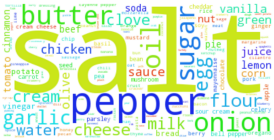
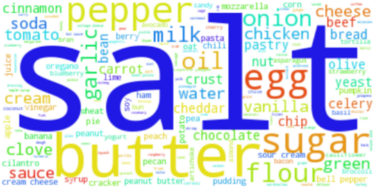
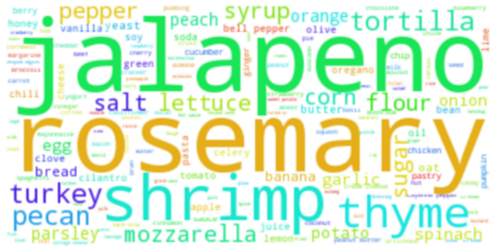
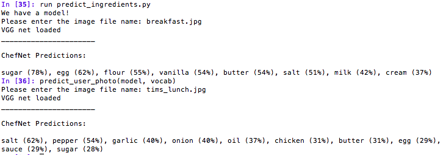

# Welcome to ChefNet

Here you may find my Galvanize Capstone Project.

__Outline__

* [Data](#data)
* [Ingredient Labeling](#ingredient-label-wrangling)
* [Image Processing](#image-processing)
* [Neural Network Architecture](#neural-network-architecture)
* [Results](#results)
* [Try out ChefNet yourself](#Try-out-ChefNet-yourself)
* [Data Issues](#data-issues)
* [Next Steps](#next-steps)
* [Thank yous](#thank-you)
* [References](#references)


### Motivation

What can we teach computer's about food? ChefNet is a convolutional neural network that identifies the ingredients in a dish by analyzing a picture of it.


### Data

To create a labeled dataset of images of food, I scraped the recipes and user submitted photos of 17,000 recipes, totaling 230,000 user photos, from allrecipes.com. The scraper was run on an AWS instance and took about a day to run, massive speedups may be attributed to parallelizing and threading the scraping process. Code is in the [Web Scrapers](/Scripts/Web_scrapers) folder under Scripts.

### Ingredient label wrangling



In order to train a neural net, I needed to create consistent labels for ingredients. I took two approaches. My first approach was to start with the scraped list of ingredients, and identify the keyword using the indico keyword extraction api, while iteratively remove all words not critical to the underlying food item. My second approach, which I ultimately used to train my net, was to start with a cleaned list of ingredients initially scraped from enchantedlearning.com

It is critical that image labels are as cleans as possible, otherwise the neural network will have difficulty learning. I think it is important to allow the model to have multi-word labels to represent items such as bell pepper. A useful extension of this project may be to vectorize the labels, so that the net will learn that the ingredient similarity, for example, misclassifying beef and steak is closer than chicken and peas. Vectorization methods require tokenization of text first. This may be an area worth explore further.

### Image Processing

Neural networks were trained with raw image data, and convolved imaged data that was passed though the 2014 image net winner, VGG-16 from Oxford. Transfer learning proved more fruitful given the limited size of my dataset. Activations were taken at the end of layer 30, before flattening to dense layers. It would be interesting to compare results using activations taken after these dense layers, but I did not have time to explore this comparison.

Images were downsized to 100x100 so that I could iterate through training multiple models, in the time allotted for capstone projects.

### Neural Network Architecture

My architecture went though multiple iterations, ultimately I settled on preprocessing images with VGG-16, and passing those activations into 3 hidden dense layers. My output layer consists of a sigmoid activation for each ingredient, and uses binary crossentropy loss.

### Results

Overall the model had weighted Recall of 48% and Precision of 38%. These metrics can be compared to a set of random predictions, with a similar number of true predictions as the model, and that had a Recall of 23% and Precision of 6%.

Below you may see what classes had best Recall (top 10 ranged from 75%-100%), similar to the frequecy of words:



Below represents the top classes in terms of Precision (top 10 range form 60%-100%), note that these classes are different. The generally only predicted these classes a few times in the validation set:



Here are some examples of how it predicted


### Try out ChefNet yourself

First you will need to install these dependencies, in addition to Conda:

* [Keras](http://keras.io/)

* [Skimage](http://scikit-image.org/)

* [HDF5](http://docs.h5py.org/en/latest/build.html)

You will need to download the weights of my trained convolutional neural net and place the .h5 in the [Models](/models) folder

My weights: [CNN Weights](https://drive.google.com/file/d/0B53_Ht6DdCsGMy1GTDkwR0piODg/view?usp=sharing)

You will also need to download the weights of trained VGG-16 and place the .h5 file in the [VGG Weights](/vgg_weights) folder.

VGG-16 weights: [vgg16_weights.h5](https://drive.google.com/file/d/0Bz7KyqmuGsilT0J5dmRCM0ROVHc/view)

Next you should move any image file you would like to predict on into the [images](/images) folder.

Now you can run [predict_ingredients.py](/Scripts/Ingredient_identifier) to have the model make your predictions (make sure you run from the [ingredient identifier](/Scripts/Ingredient_identifier)).

If you run the script in ipython, you may just run `predict_user_photo(model, vocab)` to predict additional photos without reloading the model.

Here is an example of how it should look:


### Data Issues

The data is not perfect, below is a slide that shows two different images for the same recipe. Not only can the sugar cookie look completely different based on the decoration decisions, but there are also misplaced pictures:


### Next Steps

There are a number of next steps that can be taken with this project.

* The model may benefit from further tuning, and more neural network structures could be explored. It may also benefit from training on full size images.

* Additional data may be scraped from other recipe websites to create a larger dataset.

* Another extension may involve true image captioning at a character or word level. I started exploring this option, but found that is was less useful toward my motivation of predicting underlying ingredients.

### Thank you

Big thank you to Jesse Lieman-Sifry for the inspiration behind this project, as well as to my Galvanize Instructors and peers for the continuous help and suggestions along the way. It was a pleasure to work with all of you.

### References

* VGG Net Representation:

``` Very Deep Convolutional Networks for Large-Scale Image Recognition
K. Simonyan, A. Zisserman
arXiv:1409.1556 ```
